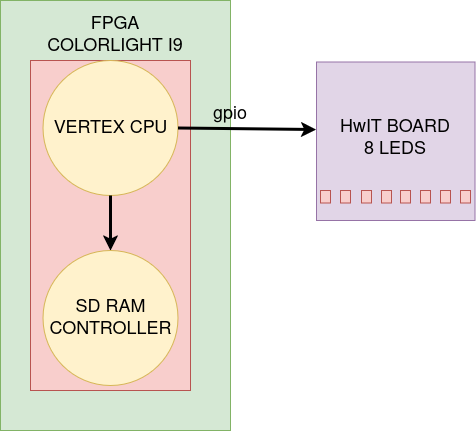

# LiteX ML Accelerator using tensorflow compression

## Description

This project implements a quantized Machine Learning model Accelerator as a custom hardware block within a LiteX, using tensorflow lite micro.

### 1. Project Overview

The objective of this project is to port and run the TensorFlow Lite Micro (TFLM) on the VexRiscv processor of the LiteX SoC used in the previous task, which is implemented on the ColorLight i9 FPGA. This work opens the door for the development of future hardware accelerators using LiteX's own tools and TFLM's "delegate" functions.

The system must load and execute the "hello_world" model from TensorFlow Lite Micro, using the model's output to control the LED array on the interface board, making the 8 LEDs light up sequentially in proportion to the output value.

### 2. Project Architecture




#### 2. PIN Map:

| LED i        | FPGA PIN       |
|--------------|----------------|
| `LED_1`      | `p17`          |
| `LED_2`      | `p18`          |
| `LED_3`      | `n18`          |
| `LED_4`      | `l20`          |
| `LED_5`      | `l18`          |
| `LED_6`      | `g20`          |
| `LED_7`      | `m18`          |
| `LED_8`      | `n17`          |


### 3. Build and Execution Instructions
The following steps assume you have the LiteX environment (Python, Migen, LiteX-Boards, RISC-V toolchain, and required Verilog/VHDL simulators) correctly set up.

#### 3.1 Clone Repository

```sh
git clone https://github.com/mateusArnaudGoldbarg/tf_litex.git
cd tf_litex
```

#### 3.2 Activate OSS CAD SUITE environment

```sh
source Path/to/oss-cad-suite/environment
```

#### 3.3 Compile Firmware
```sh
cd firmware
make
cd ..
```

#### 3.4 Compile SoC to generate FPGA's bitstream
```sh
python3 litex/colorlight_i5.py --board i9 --revision 7.2 --build --cpu-type=picorv32  --ecppack-compress
```

#### 3.5 Record bitstream of FPGA
```sh
sudo Path/to/oss-cad-suite/bin/openFPGALoader -b colorlight-i5 build/colorlight_i5/gateware/colorlight_i5.bit
```

#### 3.6 Execute Firmware
```sh
litex_term /dev/ttyACM0 --kernel firmware/firmware.bin
```

### 4. Start inference
After executing firmware, choose sin_inference in menu.

This is the result.


you can press "q" to stop the inference.

